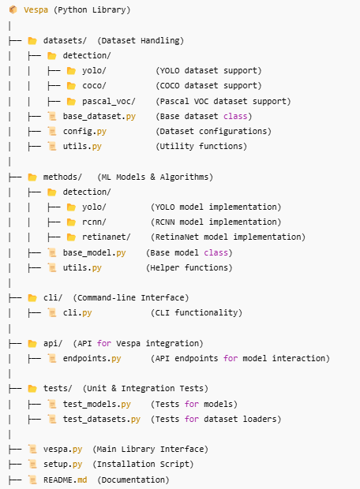

# Welcome to Vespa Documentation 🚀

This is the official documentation for the **Computer Vision API**.

## 📖 Sections
- [Installation](installation/installation.md)
- [Usage Guide](usage/setup.md)
- [API Reference](api/index.md)
- [Datasets](datasets/detection/overview.md)
- [Methods](methods/detection/index.md)
- [Development](development/structure.md)
- [FAQ](faq.md)

